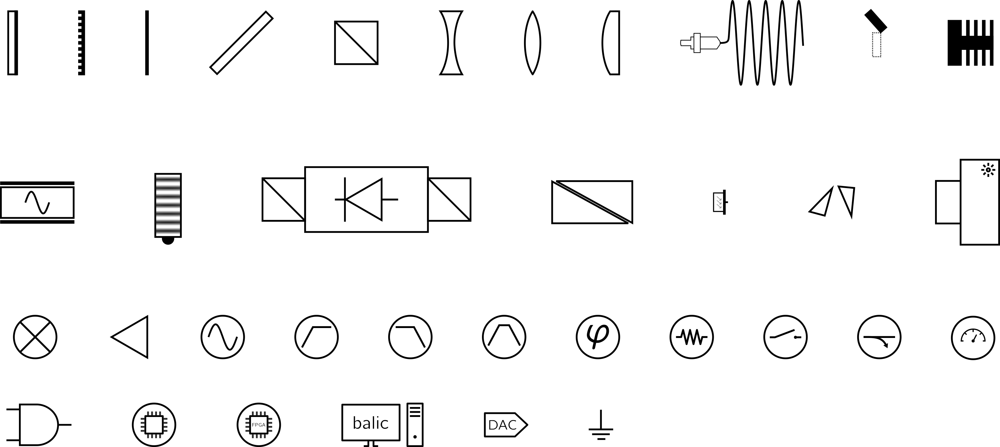

# minicoli
A minimalistic optical components library for inkscape drawings. Inspired by Alexander Franzens [ComponentLibrary](http://www.gwoptics.org/ComponentLibrary/) and the desire for more minimalistic visuals.

Optical include: mirror, grating, waveplate, dichroic mirror, beamsplitter clube, various lenses, optical fibre, shutter, beam dump, EOM, AOM, optical isolator, Glann Thompson polarizer, photodiode, anamorphic prism pair, CCD camera.

Signal path components include: mixer, amplifiger, signal source, filters, phase detector.

Let me know about ideas or part requests.
